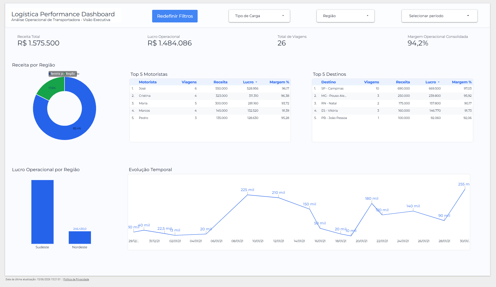

# 🚚 Transportadora Operations Analytics

Dashboard executivo para análise operacional de uma transportadora, desenvolvido com PostgreSQL (Neon), SQL Analytics e Looker Studio.

O projeto demonstra a construção de uma solução analítica completa, desde a modelagem dos dados até a criação de indicadores estratégicos para apoio à tomada de decisão.

---

# 🎯 Objetivo do Projeto

Empresas de transporte geram diariamente grandes volumes de dados relacionados a viagens, custos, receitas e operações logísticas.

O objetivo deste projeto é consolidar essas informações em uma solução analítica capaz de transformar dados operacionais em informações estratégicas, permitindo o acompanhamento do desempenho financeiro e operacional por meio de indicadores e análises visuais.

## Principais perguntas de negócio respondidas

- Qual a receita total gerada pelas operações?
- Qual o lucro operacional obtido?
- Qual a margem operacional consolidada?
- Quais regiões apresentam melhor desempenho?
- Quais motoristas geram maior resultado financeiro?
- Quais destinos concentram maior volume de receita?
- Como os resultados evoluem ao longo do tempo?

---

# 🏗️ Arquitetura da Solução


```text
Fonte de Dados (CSV)
        ↓
PostgreSQL (Neon)
        ↓
Views SQL Analíticas
        ↓
Looker Studio
        ↓
Dashboard Executivo
```

A camada SQL foi utilizada para preparação, transformação e agregação dos dados antes da construção do dashboard executivo.

---

# 🛠️ Tecnologias Utilizadas

- PostgreSQL
- Neon Database
- SQL
- Looker Studio
- Git
- GitHub

---

# 📊 Indicadores Monitorados

## KPIs Executivos

- Receita Total
- Lucro Operacional
- Total de Viagens
- Margem Operacional Consolidada

## Análises Operacionais

- Receita por Região
- Lucro Operacional por Região
- Top 5 Motoristas
- Top 5 Destinos
- Evolução Temporal dos Resultados

---

# 📈 Principais Resultados

- Receita Total: **R$ 1,57 milhão**
- Lucro Operacional: **R$ 1,48 milhão**
- Margem Operacional Consolidada: **94,2%**
- Total de Viagens Monitoradas: **26**

---

# 🔍 Desafios Técnicos

Durante o desenvolvimento do projeto foram realizadas atividades de:

- Modelagem da estrutura de dados no PostgreSQL
- Criação de métricas de receita, lucro operacional e margem operacional
- Desenvolvimento de Views SQL para consumo analítico
- Construção de indicadores executivos para tomada de decisão
- Estruturação de visualizações orientadas ao negócio
- Integração entre PostgreSQL (Neon) e Looker Studio
- Organização e versionamento do projeto utilizando Git e GitHub

---

# 🚀 Competências Demonstradas

Durante o desenvolvimento deste projeto foram aplicados conceitos de:

- SQL Analytics
- PostgreSQL
- Modelagem de Dados
- Criação de Views Analíticas
- Business Intelligence
- Storytelling com Dados
- Desenvolvimento de Dashboards
- Análise Exploratória de Dados
- Fundamentos de Analytics Engineering
- Versionamento com Git e GitHub

---

# 📂 Estrutura do Projeto

```text
transportadora-operations-analytics
│
├── README.md
│
├── sql
│   ├── create_table.sql
│   └── dashboard_view.sql
│
├── dashboard
│   ├── dashboard.png
│   └── dashboard.pdf
│
└── docs
    └── arquitetura.png
```

---

# 📸 Dashboard



---

# 🔗 Dashboard Online

Acesse a versão interativa do dashboard:

👉 [Visualizar Dashboard no Looker Studio](https://datastudio.google.com/reporting/09107122-bc34-4042-b1ea-26d81781f1ef)

---

# 👨‍💻 Autor

**Antonio Estêvão**

Profissional em formação nas áreas de Dados, Business Intelligence e Analytics Engineering.

Este projeto foi desenvolvido como parte do meu portfólio prático, aplicando conceitos de SQL Analytics, PostgreSQL, modelagem de dados e construção de dashboards executivos.

---

# 📌 Observação

Este projeto possui finalidade educacional e demonstra a construção de uma solução analítica completa, desde a modelagem dos dados até a criação de dashboards para apoio à tomada de decisão.
